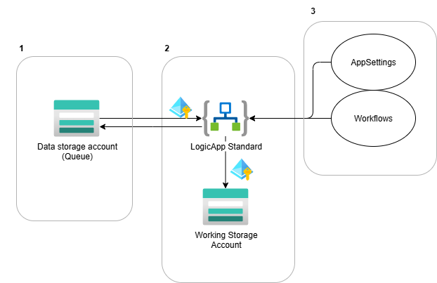

# Deployment Stack Demo

# 1. Overview
In this demo we will deploying a simple setup where a Logic App Standard will be communicating to a storageAccount queue, to simulate some external data source. These connections will be secured by using managed identity + RBAC.



These deployments are split into 3, as there are 3 separate lifecycles.
1. Infra (bicep) of the StorageAccount + queue
2. Infra (bicep) of the LogicApp Standard (Includes stuff like working storage account, identity etc.)
3. Application of the LogicApp Standard (AppSettings + workflows).


# 2. Bicep overview
There are 3 main.biceps to deploy each of the 3 components which have a separate lifecycle.
1. [Data StorageAccount (with Queue)](../src/bicep/resourceGroup/infra-storage.main.bicep)
2. [LogicApp Standard](../src/bicep/resourceGroup/infra-application.main.bicep)
3. [LogicApp Standard AppSettings](../src/bicep/resourceGroup/application.bicep)

Next to this, for demo purposes the names of all the resources deployed is located in [a shared resourceNames file](../src/bicep/resourceGroup/resourceNames.bicep).


The same setup is repeated for deployments on subscription level.
These are the same biceps, with the exception that the targetscope has been set to "Subscription" instead of the default "ResourceGroup".


# 3. Standard bicep deployment

In this chapter, we will first deploy the biceps without using deployment stacks.

## Set variables
```powershell
$tenantId = "c8feaf08-21fc-4dc8-b637-bfd091677a97"
$subscriptionId = "61d748b8-2dcc-4406-ae38-17ccb641b188"
$rg = "anmo-nostack-demo"
$loc = "westeurope"
```

## Login
```powershell
az login --tenant $tenantId
az account set --subscription $subscriptionId
```

# Create Resource Group
```powershell
az group create --name $rg --location $loc
```

# Deploy Storage Account with Queue
```powershell
az deployment group create --resource-group $rg --template-file "../src/bicep/resourceGroup/infra-storage.main.bicep"
```

# Deploy Logic App Standard
```powershell
az deployment group create --resource-group $rg --template-file "../src/bicep/resourceGroup/infra-application.main.bicep"
```

# Deploy Logic App Standard AppSettings
```powershell
az deployment group create --resource-group $rg --template-file "../src/bicep/resourceGroup/application.bicep"
```


If now, we would like to (temporarily) delete parts of this deployment (to either redeploy, or save costs), there are some drawbacks that arise:
- Manual selection of what parts we should delete.
- More hidden resources/deployments like RBAC/Alerts/...
    - We've all bumped into the "orphaned role assignments" before 😉
- Harder to automate deletion, unless we have a full whitelist of what to delete.
- Usually undesirable to delete everything (e.g. User-assigned IDs).
    - Requires automation with something like AZ CLI.


# 4. Deployment Stacks
Enter deployment stacks! Deployment stacks allow for some degree of state management by grouping related resources, and tracking their state.
This can be done at both the resourceGroup or Subscription Level.

If you wish to delete the resources, you no longer require some manual setup/intervention, you can simply delete the stack.
Or, if you update your biceps, and you immediatelly want to clean up any orphaned resources, you can use do this using the **actionOnUnmanage** feature. This has 3 modes:
- DeleteAll: Deletes all unmatched resources and resourceGroups.
- DeleteResources: Delete only the resources.
- DetachAll: Detach the resources (resources keep existing, just no longer part of the stack)


Typically you will scope a deployment stack to resources that have the same lifecycle (~main.bicep). 
To deploy using a deployment stack on **resourceGroup** level, you can use the following AZ CLI command:

```powershell
                  az stack group create 
                    --name <stackname>
                    --resource-group <rg-name>
                    --template-file <path>
                    --parameters <path>
                    --action-on-unmanage <DeleteAll/DeleteResouces/DetachAll>
                    --deny-settings-mode <none/denyDelete/denyWriteAndDelete>
```

Or to scope to **subscription**:
```powershell
                  az stack sub create 
                    --name <stackname>
                    --location <location>
                    --template-file <path>
                    --parameters <path>
                    --action-on-unmanage <DeleteAll/DeleteResouces/DetachAll>
                    --deny-settings-mode <none/denyDelete/denyWriteAndDelete>
```


# 5. Deploy resources using deployment stack at resourceGroup level

## Set variables
```powershell
$tenantId = "c8feaf08-21fc-4dc8-b637-bfd091677a97"
$subscriptionId = "61d748b8-2dcc-4406-ae38-17ccb641b188"
$rg = "anmo-stack-rg-demo"
$loc = "westeurope"

$dataStackName = 'anmo-data-stack'
$logicAppStackName = 'anmo-logicapp-stack'
$logicAppAppSettingsStackName = 'anmo-logicapp-appsettings-stack'
```

## Login
```powershell
az login --tenant $tenantId
az account set --subscription $subscriptionId
```

# Create Resource Group
```powershell
az group create --name $rg --location $loc
```

# Deploy resource using stacks
```powershell
az stack group create `
                    --name $dataStackName `
                    --resource-group $rg `
                    --template-file "../src/bicep/resourceGroup/infra-storage.main.bicep" `
                    --action-on-unmanage 'DeleteAll' `
                    --deny-settings-mode 'none'


az stack group create `
                    --name $logicAppStackName `
                    --resource-group $rg `
                    --template-file "../src/bicep/resourceGroup/infra-application.main.bicep" `
                    --action-on-unmanage 'DeleteAll' `
                    --deny-settings-mode 'none'

az stack group create `
                    --name $logicAppAppSettingsStackName `
                    --resource-group $rg `
                    --template-file "../src/bicep/resourceGroup/application.bicep" `
                    --action-on-unmanage 'DeleteAll' `
                    --deny-settings-mode 'none'
```


We can then navigate to the Azure portal to the resourceGroup, and go to "Deployment Stacks" to view and manage the deployment stacks.

The [LogicApp Standard bicep](../src/bicep/resourceGroup/infra-application.main.bicep) has a switch to change roleAssignments between working & data storage account to simulate the state management deployment stacks provide.


# 6. Deploy resources using deployment stack at subscription level

This is the same excercise as in 5, except on subscription level.
The templates are mostly the same, but now 2 resourceGroups have been defined in the naming bicep, one for the data and one for the application.

The biceps have been modified to set targetScope = 'subscription' and adjust the deployments' scopes accordingly.

## Set variables
```powershell
$tenantId = "c8feaf08-21fc-4dc8-b637-bfd091677a97"
$subscriptionId = "61d748b8-2dcc-4406-ae38-17ccb641b188"

$location = 'westeurope'
$dataStackName = 'anmo-data-stack'
$logicAppStackName = 'anmo-logicapp-stack'
$logicAppAppSettingsStackName = 'anmo-logicapp-appsettings-stack'
```

## Login
```powershell
az login --tenant $tenantId
az account set --subscription $subscriptionId
```

# Deploy resources using stacks at subscription level
```powershell
az stack sub create `
                    --name $dataStackName `
                    --location $location `
                    --template-file "../src/bicep/subscription/infra-storage.main.bicep" `
                    --action-on-unmanage 'DeleteAll' `
                    --deny-settings-mode 'none'


az stack sub create `
                    --name $logicAppStackName `
                    --location $location `
                    --template-file "../src/bicep/subscription/infra-application.main.bicep" `
                    --action-on-unmanage 'DeleteAll' `
                    --deny-settings-mode 'none'

az stack sub create `
                    --name $logicAppAppSettingsStackName `
                    --location $location `
                    --template-file "../src/bicep/subscription/application.bicep" `
                    --action-on-unmanage 'DeleteAll' `
                    --deny-settings-mode 'none'
```


