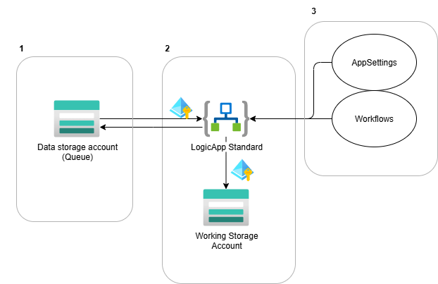

# Deployment Stack Demo

# 1. Overview
In this demo we will deploying a simple setup where a Logic App Standard will be communicating to a storageAccount queue, to simulate some external data source. These connections will be secured by using managed identity + RBAC.



These deployments are split into 3, as there are 3 separate lifecycles.
1. Infra (bicep) of the StorageAccount + queue
2. Infra (bicep) of the LogicApp Standard (Includes stuff like working storage account, identity etc.)
3. Application of the LogicApp Standard (AppSettings + workflows).


# 2. Bicep overview
There are 3 main.biceps to deploy each of the 3 components which have a separate lifecycle.
1. [Data StorageAccount (with Queue)](../src/bicep/resourceGroup/infra-storage.main.bicep)
2. [LogicApp Standard](../src/bicep/resourceGroup/infra-logicapp.main.bicep)
3. [LogicApp Standard AppSettings](../src/bicep/resourceGroup/application.bicep)

Next to this, for demo purposes the names of all the resources deployed is located in [a shared resourceNames file](../src/bicep/resourceGroup/resourceNames.bicep).


The same setup is repeated for deployments on subscription level.
These are the same biceps, with the exception that the targetscope has been set to "Subscription" instead of the default "ResourceGroup".


# 3. Standard bicep deployment

In this chapter, we will first deploy the biceps without using deployment stacks.

## Set variables
```powershell
$tenantId = "c8feaf08-21fc-4dc8-b637-bfd091677a97"
$subscriptionId = "61d748b8-2dcc-4406-ae38-17ccb641b188"
$rg = "anmo-nostack-demo"
$loc = "westeurope"
```

## Login
```powershell
az login --tenant $tenantId
az account set --subscription $subscriptionId
```

# Create Resource Group
```powershell
az group create --name $rg --location $loc
```

# Deploy Storage Account with Queue
```powershell
az deployment group create --resource-group $rg --template-file "../src/bicep/resourceGroup/infra-storage.main.bicep"
```

# Deploy Logic App Standard
```powershell
az deployment group create --resource-group $rg --template-file "../src/bicep/resourceGroup/infra-logicapp.main.bicep"
```

# Deploy Logic App Standard AppSettings
```powershell
az deployment group create --resource-group $rg --template-file "../src/bicep/resourceGroup/application.bicep"
```
